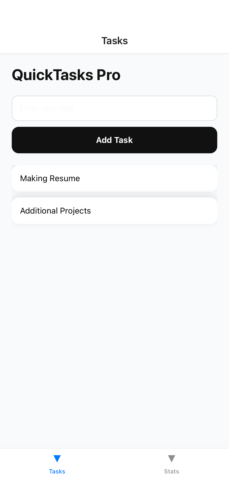

# QuickTasks — React Native Productivity App

QuickTasks Pro is a cross-platform productivity mobile application built using **React Native and Expo**, designed to help users manage daily tasks efficiently with persistent storage and multi-screen navigation.

---

<h3>## Features</h3>h3>
- Add and manage daily tasks
- Persistent storage using AsyncStorage
- Bottom tab navigation (Tasks / Stats)
- Live productivity statistics
- Clean mobile-first UI design

---

<h3>## Tech Stack</h3>
- React Native
- Expo
- TypeScript
- AsyncStorage
- React Context API

---

<h3>## Screens</h3>
- Tasks Screen – Create and manage tasks
- Stats Screen – View productivity insights

---

<h3>## App Preview</h3>

### Tasks Screen
<p align="center">
  
</p>

### Stats Screen
<p align="center">
  
</p>


---

<h3>## Installation</h3>

```bash
git clone https://github.com/Atharva-Hegade/quicktasks.git
cd quicktasks
npm install
npm start
```
